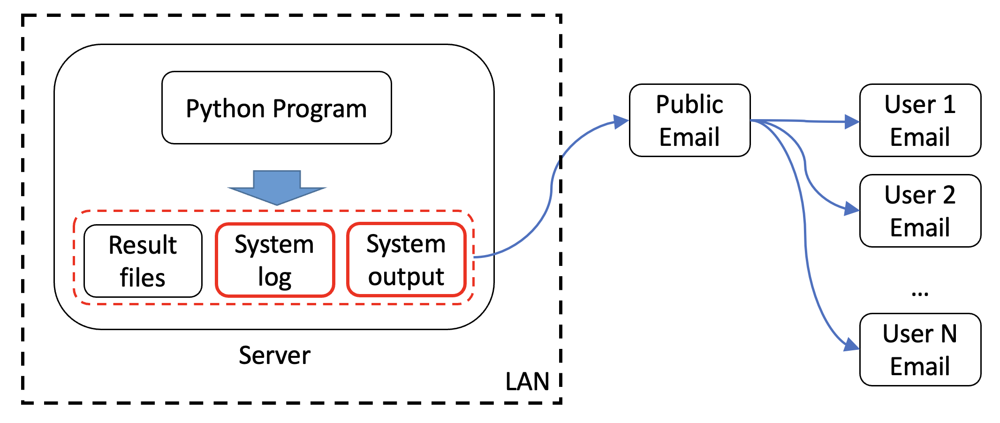
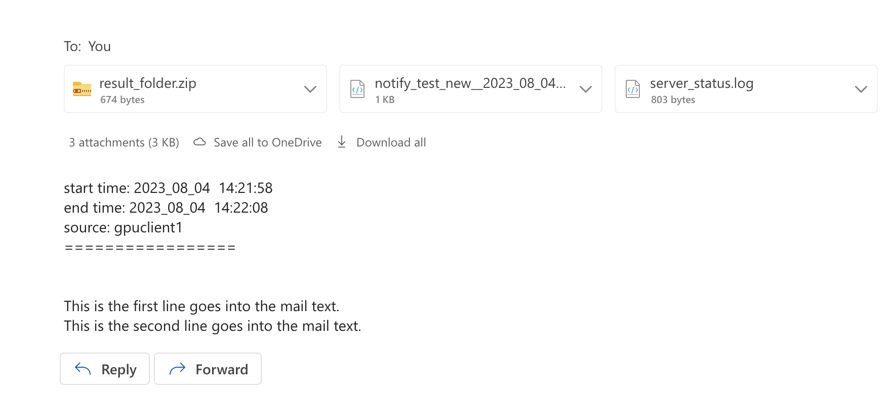

# Notify-Email



**Notifyemail** is a package that sends notifications via email when your code finishes running on a remote server. With the assistance of Notifyemail, you can receive the running results of your program at the first time, even if your server is within a Local-Area-Network (LAN). It also works well with other environments like Google Colab and notifies you of the results when program finished.

Hope it can do some help for your project :)


## Requirements

You need a public email. 

About how to setup a public email:
* [smtp_usage.md](./smtp_usage.md)
* [smtp_usage_chinese.md](./smtp_usage_chinese.md)


## How to install

Use pip to install our module:

```bash
pip install notifyemail
```


## How to use

First, import notifyemail module.

```python
import notifyemail as notify
```

Add the following line at the start of your program:
```python
notify.setup(mail_host='smtp.163.com', 
             mail_user='xxxxxx@163.com', 
             mail_pass='xxxxxx',
             log_root_path='log', 
             mail_list=['xxxxxxx@xxx.com'])
```

This line will start a background task that keeps monitoring your program running status and server status. Upon your program ends or encounters a failure, the background process will try to send you an email with program outputs and other essential information.

After the above setting, all your terminal outputs like `print` or error information will be logged. You may also use the following two methods to add more text or files into the email.

```bash
# You may use notify.add_text() to add words into the body of the email.
notify.add_text('This is the first line goes into the mail text.')
notify.add_text('This is the second line goes into the mail text.')

# You may use notify.add_file() to add a folder into your email.
# The folder will be compressed and attached to the email after your program ends.
A_file_path = './examples'
notify.add_file(A_file_path)
```


## Example

An example is shown here:

```python
# 1. Import the package.
import notifyemail as notify

# 2. Please reset Notify frontend before running any task, otherwise 
# some output may not be logged.
notify.setup(mail_host='smtp.163.com', 
             mail_user='xxxxxx@163.com', 
             mail_pass='xxxxxx',
             log_root_path='notify_log', 
             mail_list=['xxxxxx@xxx.com'])

# 3. System output will be logged and you may check in your email.
print('Hello world!')
import time
for i in range(5):
    print(f'{i}: Your program is running...')
    time.sleep(1)

# 4. You can use notify.add_text() to add words in the body of the email.
notify.add_text('This is the first line goes into the mail text.')
notify.add_text('This is the second line goes into the mail text.')

# 5. You can use notify.add_file() to add a folder into your email.
# The folder will be compressed and attached to the email after your program ends.
a_file_path = './result_folder'
notify.add_file(a_file_path)

# 6. After meeting an error or for any reason, the program died, notifyemail will try to 
# send the program output to the listed mailboxes. This can help you diagnosis 
# the program issues.
print('Here comes an error!')
something_went_wrong_here
```

After running the above example, you may receive an email as shown below:




The attachment file contains the system output:

```text
*****************LOG_Cache_2023_08_04_14_21*****************
Notifyemail initialized.
 - log_root_path:          notify_log
 - mail_user:              xxxxxx@163.com
 - default_receiving_list: ['xxxxxx@xxx.com']
notify_test_new
start monitoring:)
Hello world!
0: Your program is running...
1: Your program is running...
2: Your program is running...
3: Your program is running...
4: Your program is running...
./result_folder  has been added to the mail attachment list.
Here comes an error!
Traceback (most recent call last):
  File "/home/workenv/notifyemail/test_env/notify_test_new.py", line 60, in <module>
    something_went_wrong_here
NameError: name 'something_went_wrong_here' is not defined
finished

============================================================
Processing finished !
start time: 2023_08_04  14:21:58
end time: 2023_08_04  14:22:08
source: gpuclient1
An additional file has been added to the mail: result_folder.zip
```

And also the server running status:

```text
============================================
Monitoring Start Time:   2023-08-04 14:21:58
Sample Interval (s):    5  | Log Write Interval (s):   300  
============================================
Time: 2023-08-04 14:22:08  | CPU: 0.14   | Mem: 6.0    
============================================
Monitoring End Time:     2023-08-04 14:22:08
Average CPU Usage:       0.14  | Average Memory Usage:   6.0
Maximum CPU Usage:       0.15  | Maximum Memory Usage:   6.0
```

The `result_folder.zip` contains the folder `./result_folder` and its content as specified using `notify.add_file()`.


## Change log

2023-08-04:
* Integrate `notify.Reboost` and `notify.send_log` into `notify.setup` function. You can call `notify.setup` at the beginning of your program instead of calling `notify.Reboost` and `notify.send_log` separately. The previous method is still supported.
* Add examples under `./examples`.
* Re-arranged the notifyemail project structure.
* Translate all comments into English.


## Contribution list

吕尚青  @lsqqqq

张天翊  @sagizty

雷言理  @Desperadodo

吴雨卓 @[Vision0220](https://github.com/Vision0220)

栾为坚 @1luan

